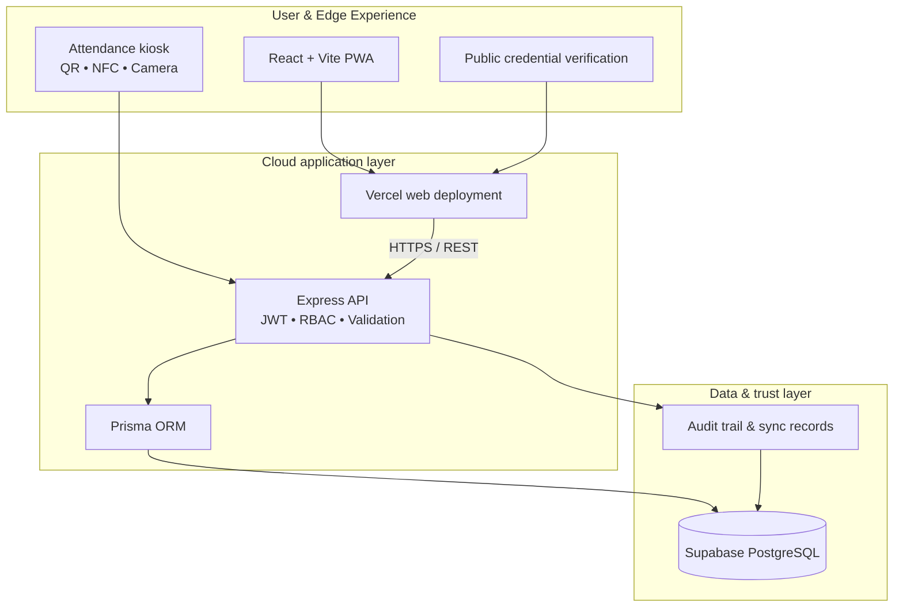
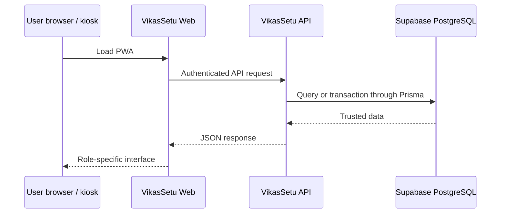

# VikasSetu

### Integrated Cooperative Training & Employment Platform

**VikasSetu** is a digital public-infrastructure platform for cooperative training institutes. It unifies programme delivery, multilingual learning, verified attendance, credentials, and employment discovery into one offline-aware experience.

[](https://vikassetu-fling-solutions-projects.vercel.app)
[](https://backend-fling-solutions-projects.vercel.app/api/health)
[](https://react.dev/)
[](https://www.typescriptlang.org/)
[](https://supabase.com/)

---

## The challenge

Cooperative-sector training spans multiple institutes, languages, devices, and levels of connectivity. VikasSetu closes the gaps between enrolment, learning outcomes, attendance integrity, certification, and employment opportunities.

## What VikasSetu delivers

- **Role-specific workspaces** for trainees, faculty, institute administrators, national administrators, employers, device operators, and hostel administrators.
- **Multilingual learning** with English, Hindi, and Marathi content paths.
- **Attendance that works beyond the network** using QR, NFC, biometric-ready kiosk workflows, and an offline sync queue.
- **Verifiable credentials** with public certificate and digital skill-card validation.
- **Employment bridge** connecting trained cooperative-sector talent with employer partners.
- **Operational visibility** across institutes, programmes, batches, capacity, devices, and learner progress.

## System architecture



### Request lifecycle



## Technology

| Layer | Implementation |
| --- | --- |
| Frontend | React 18, TypeScript, Vite, Tailwind CSS, PWA |
| Backend | Node.js, Express, TypeScript, Zod |
| Authentication | JWT, bcrypt, role-based access control |
| Database | Supabase PostgreSQL, Prisma ORM |
| Deployment | Vercel |
| Documents & visuals | jsPDF, QR code generation, Recharts |

## Key workflows

1. An institute publishes a programme and manages batches, schedules, capacity, and learner nominations.
2. A trainee learns in their preferred language, completes quizzes, and tracks progress through the PWA.
3. Attendance is captured through classroom check-in workflows and synchronized safely after connectivity returns.
4. Faculty and administrators monitor progress, attendance, assessments, and certificate eligibility.
5. Verified skills and certificates can be shared publicly with employer partners.

## Roles

| Role | Primary workspace |
| --- | --- |
| Trainee | Courses, assessments, attendance, certificates, jobs |
| Faculty | Curriculum, live sessions, attendance, grading |
| Institute administrator | Batches, nominations, operations, certificates |
| National administrator | Institute network, programmes, analytics, governance |
| Employer | Jobs, candidate discovery, verified skills |
| Device operator | Kiosk status, diagnostics, sync monitoring |
| Hostel administrator | Accommodation and resident operations |

## Run locally

### Prerequisites

- Node.js 20 or newer
- Docker Desktop (optional, for local PostgreSQL)

### 1. Install dependencies

```bash
npm install
cd backend && npm install && cd ..
```

### 2. Configure environment files

```bash
cp .env.example .env
cp backend/.env.example backend/.env
```

Set `DATABASE_URL`, `DIRECT_URL`, and `JWT_SECRET` in `backend/.env`. For a local database, start the included PostgreSQL service:

```bash
npm run db:up
```

### 3. Prepare the database

```bash
cd backend
npx prisma migrate deploy
npx prisma generate
cd ..
```

### 4. Start the application

In two terminals:

```bash
# Terminal 1 — API
cd backend && npm run dev
```

```bash
# Terminal 2 — web app
npm run dev
```

Open the address printed by Vite, normally `http://localhost:5173`.

## Production configuration

The web app receives its API location through `VITE_API_URL`.

| Service | URL |
| --- | --- |
| Web platform | https://vikassetu-fling-solutions-projects.vercel.app |
| API health endpoint | https://backend-fling-solutions-projects.vercel.app/api/health |

For the API deployment, configure:

```text
DATABASE_URL
DIRECT_URL
JWT_SECRET
NODE_ENV=production
FRONTEND_URL
```

Never commit real environment files, database URLs, passwords, or JWT secrets.

## Project layout

```text
.
├── src/                  # React application, views, components, API client
├── backend/
│   ├── src/              # Express routes, controllers, middleware, services
│   └── prisma/           # Prisma schema, migrations, and seed utilities
├── public/               # Static assets
├── docker-compose.yml    # Optional local PostgreSQL service
└── vercel.json           # Vercel web deployment configuration
```

## API health check

```bash
curl https://backend-fling-solutions-projects.vercel.app/api/health
```

Expected response:

```json
{ "status": "ok", "service": "VikasSetu API" }
```

## Security model

- Passwords are hashed with bcrypt.
- API authorization is enforced with signed JWTs and role checks.
- Production database credentials remain server-side only.
- Client-to-API traffic is protected with HTTPS and origin-aware CORS.
- Prisma parameterizes database operations to reduce injection risk.

---

Built to make cooperative learning, verification, and opportunity more connected.
